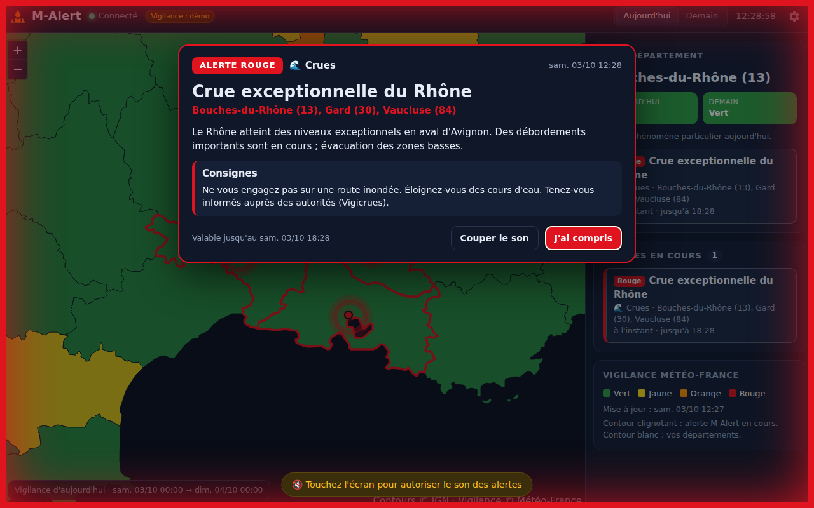
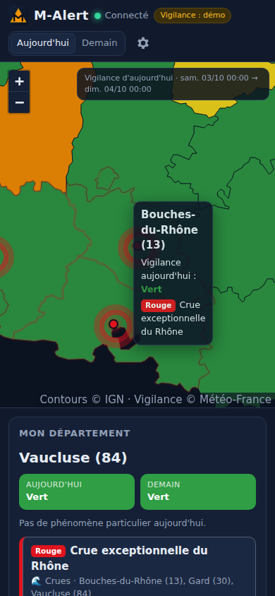

# M-Alert

Cette application diffuse des informations que j'envoie via mon module M-Alert, en fonction du département.

Pour recevoir les alertes que j'envoie (dont la source vient des centres météorologiques français comme Météo-France), il faut configurer votre département dans les réglages ou à la première ouverture de l'application.





## Fonctionnalités

- **Carte interactive** des départements, colorés selon la **vigilance Météo-France** (vert, jaune, orange, rouge), pour aujourd'hui et demain. Survolez un département pour voir les phénomènes (orages, vent, crues…).
- **Alerte plein écran** dans le style de JQuake / GlobalQuake : cadre clignotant à la couleur du niveau, titre, départements concernés, description et consignes.
- **Son d'alerte** différent selon le niveau (information, jaune, orange, rouge). Pour l'orange et le rouge, le son peut être répété jusqu'à « J'ai compris ».
- **Notification système** avec la description de l'alerte.
- **Marqueurs pulsants** sur les départements en alerte, pour bien voir même les petits départements (Paris, petite couronne…).
- Les alertes envoyées pendant que l'application était fermée s'affichent au démarrage.
- Prévenu aussi quand la vigilance de vos départements passe en jaune, orange ou rouge (désactivable).
- **Réglages** : département principal, autres départements suivis, alertes de toute la France, niveau minimum, son et volume, notifications, notifications push, fond de carte détaillé, lancement au démarrage, adresse du serveur.

## Utilisation

### Application de bureau (Windows, macOS, Linux)

M-Alert reste dans la zone de notification quand on ferme la fenêtre (comme JQuake) et passe au premier plan lors d'une alerte.

```bash
npm install
npm start          # lancer l'application
npm run dist       # créer l'installateur pour votre système (dossier dist/)
```

Les installateurs peuvent aussi être construits par GitHub : onglet **Actions** > **Applications de bureau** > *Run workflow*, ou en poussant un tag `v1.0.0` (les fichiers sont joints à une *Release*).

### Version web (téléphone, navigateur)

Le dossier `web/` est un site statique. Le workflow **Version web (GitHub Pages)** le publie automatiquement à chaque modification sur `main` (à activer une fois : *Settings > Pages > Source : GitHub Actions*).

Sur téléphone, ouvrez la page puis « Ajouter à l'écran d'accueil ». Cochez **Recevoir les alertes même quand l'application est fermée (push)** dans les réglages pour être notifié application fermée. Sur iPhone, les notifications push nécessitent iOS 16.4 ou plus et que M-Alert soit ajouté à l'écran d'accueil.

Pour tester en local : `npm run web` puis ouvrez http://localhost:5173.

## Configuration

Les alertes passent par le serveur M-Alert (dossier `server/` du dépôt **M-Alert-sender**). Indiquez son adresse dans `web/config.js` pour que les utilisateurs n'aient rien à saisir :

```js
window.MALERT_CONFIG = {
  serverUrl: 'https://mon-serveur-malert.onrender.com',
};
```

L'adresse reste modifiable dans les réglages de l'application.

## Ajouter le son d'alerte

Déposez vos fichiers MP3 dans `web/sounds/` :

| Fichier | Niveau |
| --- | --- |
| `alerte-1.mp3` | Information |
| `alerte-2.mp3` | Jaune |
| `alerte-3.mp3` | Orange |
| `alerte-4.mp3` | Rouge |
| `alerte.mp3` | Son unique, utilisé si le fichier du niveau n'existe pas |

Sans fichier, une sirène synthétique est jouée. Réglages > **Tester une alerte** permet de vérifier le son, l'affichage et les notifications.

## Structure

```
main.js, preload.js     Application de bureau (Electron)
web/                    Interface (aussi utilisable comme site web)
  index.html, config.js
  js/app.js             Logique : connexion temps réel, alertes, réglages
  js/map.js             Carte des départements (Leaflet)
  js/sound.js           Son d'alerte
  sw.js                 Service worker (notifications push)
  data/departements.js  Contours des départements
  sounds/               Vos sons d'alerte
```

## Crédits

- Vigilance : © Météo-France (API « Données Publiques Vigilance »).
- Contours des départements : IGN Admin Express via [france-geojson](https://github.com/gregoiredavid/france-geojson) (Licence Ouverte).
- Carte : [Leaflet](https://leafletjs.com) (BSD-2). Fond de carte détaillé : © OpenStreetMap, © CARTO.
